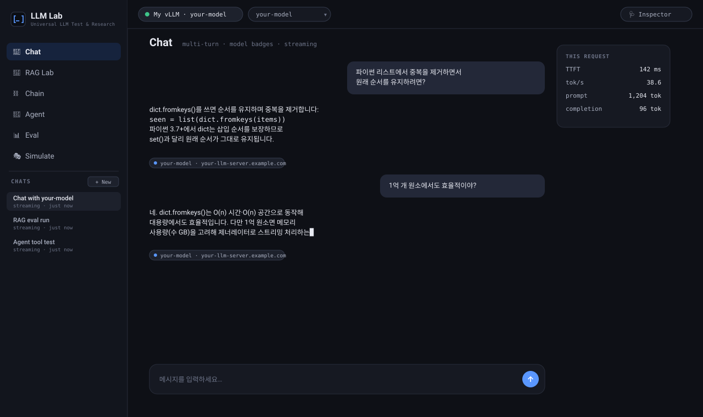
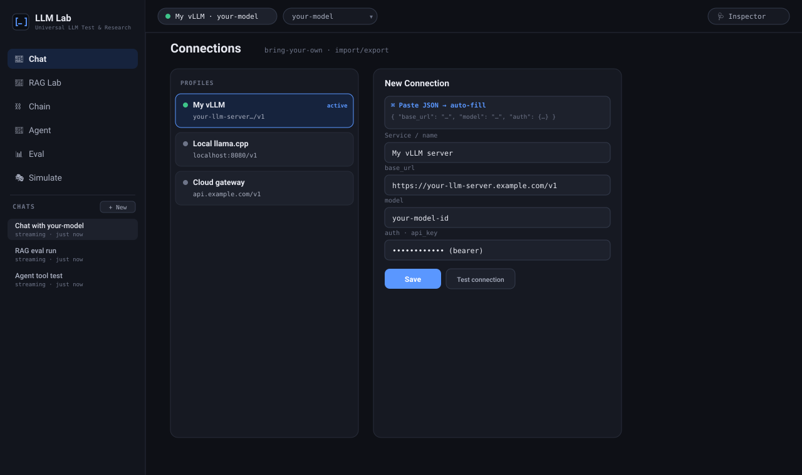
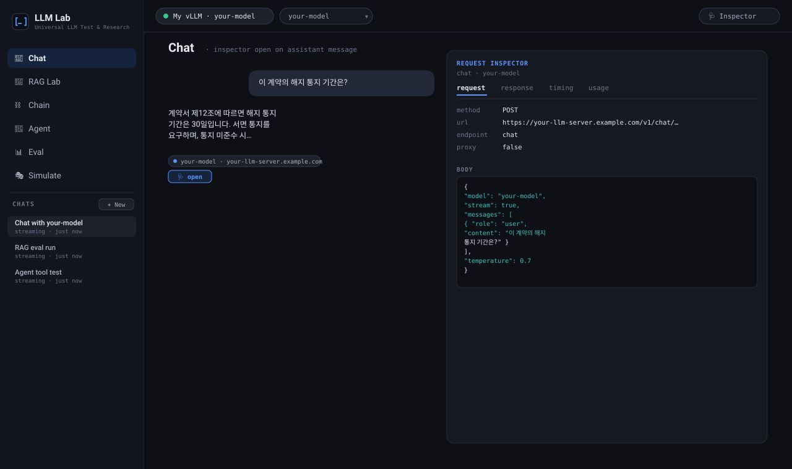
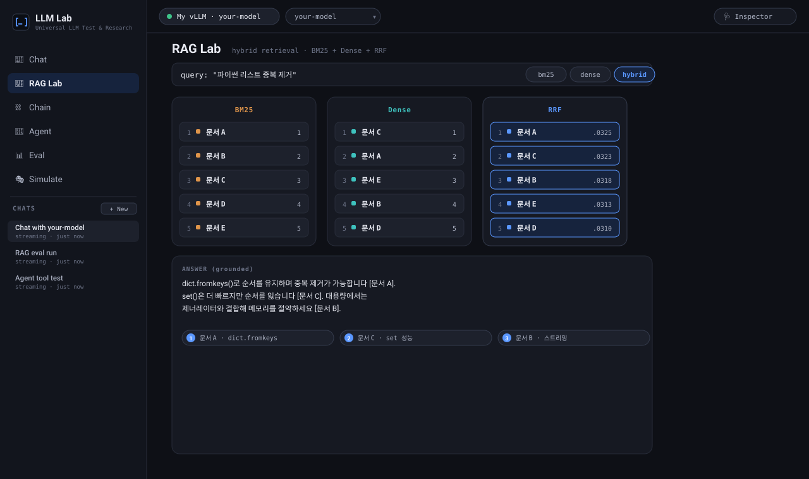
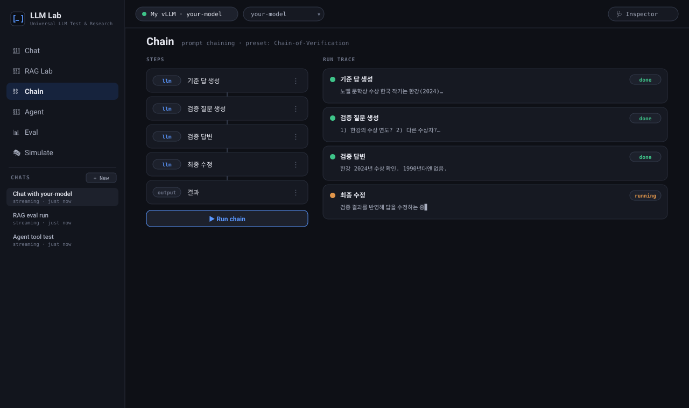
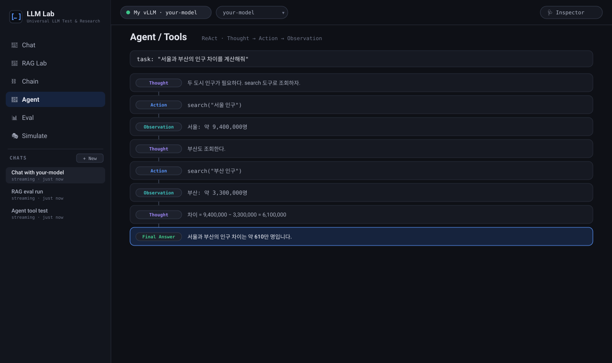
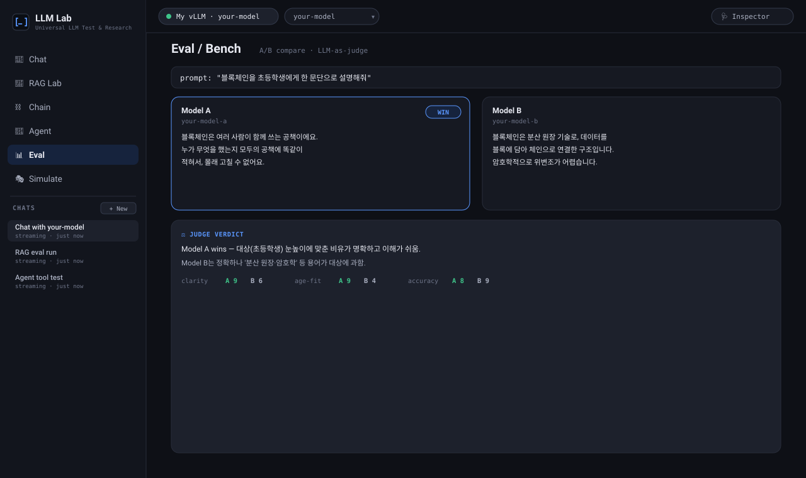

<div align="center">

# LLM Lab

### Universal LLM Test & Research Platform

A **pure‑frontend, bring‑your‑own‑key** workbench to connect any **OpenAI‑compatible** LLM API and experiment with chat, RAG, prompt chaining, agents, evaluation, and simulation — with a deep request inspector and an optional PHP backend for real databases.

**No build step · No framework · No hardcoded model** — just open `index.html`.

[English](#english) · [한국어](#한국어)



</div>

---

<a name="english"></a>
## English

### What is LLM Lab?

**LLM Lab** is a single‑page web application for **engineers and researchers** who need to *test, compare, and experiment with* Large Language Model API servers. You point it at any OpenAI‑compatible endpoint (vLLM, llama.cpp server, LM Studio, TGI, or a commercial gateway), and it becomes a full research console: multi‑turn chat, retrieval‑augmented generation, prompt‑chaining workflows, tool‑using agents, A/B evaluation, and model‑vs‑model simulation — all in the browser, with **every request fully inspectable**.

It ships with **no default model and no keys**. You add your own **connection profiles** (paste a JSON blob or fill a form), and they live only in your browser's `localStorage`.

### Why does it exist?

Testing an LLM endpoint usually means scattered `curl` commands, throwaway Python scripts, or heavyweight platforms that assume one specific provider. LLM Lab solves a narrower, practical problem:

- **"Does this model server actually work, and how well?"** — connect, chat, and read TTFT / tokens‑per‑second / token usage per request.
- **"How do advanced techniques behave on *my* model?"** — run hybrid RAG, prompt chains, ReAct agents, and evals against the exact endpoint you operate, not a vendor's playground.
- **"What was actually sent and received?"** — a request inspector shows the real URL, headers, body, streamed chunks, timing, and usage for every message — attributed **per message**, so switching models mid‑conversation stays traceable.
- **Zero lock‑in** — pure HTML/CSS/JS, no build, no framework, no account. Deploy it on any static host, or add a tiny PHP backend when you need a CORS‑free proxy or real databases.

### Features

| Workbench | What it does |
|---|---|
| 💬 **Chat** | Multi‑turn chat with model switching, multiple conversation sessions (ChatGPT‑style), per‑message model badges, streaming, and reasoning display. |
| 🔎 **RAG Lab** | Retrieval experiments — **BM25** (lexical), **dense** (embedding), **hybrid** with **RRF** (Reciprocal Rank Fusion), a **reranking** stage (cross‑encoder / LLM‑as‑reranker), a **retrieval‑evaluation harness** (**nDCG@k · MRR · Recall@k · MAP**), an **embeddings explorer** (similarity heatmap + 2D projection), and a **GraphRAG** viewer. |
| ⛓️ **Chain** | Prompt‑chaining / workflow runner with `llm` · `condition` (branching) · `transform` (JS) · `output` steps and **20 built‑in presets** (CoT, Self‑Refine, CoVe, Least‑to‑Most, Map‑Reduce, classify‑route, evaluator‑optimizer, and more). |
| 🤖 **Agent / Tools** | ReAct‑style agent loop (Thought → Action → Observation) with tool calls. |
| 📊 **Eval / Bench** | A/B comparison, N‑run variance, word‑level diff, LLM‑as‑judge scoring, **parameter sweeps** (grid search over sampling params), and **endpoint load/latency benchmarking** (p50/p95/p99 TTFT, throughput, concurrency sweep). |
| 📦 **Batch** | Run a prompt or chain over a **CSV/JSONL dataset** with `{{column}}` templating, bounded concurrency, and CSV/JSONL export. |
| 🎭 **Simulate** | Automated model‑vs‑model (or persona‑vs‑persona) conversations. |
| 🔌 **Connections** | Bring‑your‑own connection profiles with import/export, JSON paste‑to‑autofill, and an engineer‑grade settings panel (context window, all sampling params, `extra_body`). |
| 🩺 **Inspector** | Per‑request URL / headers / body / response / raw stream / timing (TTFT, tok/s) / token usage, plus copy‑ready `curl` · Python · `fetch` snippets. |

### Screenshots

> The images below are illustrative UI mockups of each workbench (the real app uses the same dark theme). To swap in real captures, replace the files in `docs/images/` — see [`docs/images/CAPTURE_GUIDE.md`](docs/images/CAPTURE_GUIDE.md).

| Connection management | Request inspector |
|---|---|
|  |  |

| RAG Lab (hybrid / RRF) | Prompt chaining |
|---|---|
|  |  |

| Agent / Tools | Evaluation |
|---|---|
|  |  |

### Quick start

**Option A — Static (simplest).** Serve the folder with any static web server (or open `index.html` directly):

```bash
python -m http.server 8080
# then open http://localhost:8080
```

Add a connection profile in the UI (**Connections → New**), paste your endpoint info, and start chatting. In static mode, the browser calls your LLM endpoint **directly**, so the endpoint must be reachable from the browser and (on an HTTPS page) served over **HTTPS** with permissive CORS.

**Option B — With the PHP backend (recommended for real use).** Deploy to any Apache + PHP shared host. This enables:

- `proxy.php` — a server‑side relay for your LLM calls (avoids browser CORS / mixed‑content, streams SSE).
- `search.php` — a web‑search proxy for RAG.
- `db/` — real database connections (see below).

**Option C — Local dev backend.** `server.py` provides the same `/api/proxy` and `/api/search` endpoints for local development:

```bash
python server.py   # serves the app + proxy on a local port
```

### Connecting a model

A connection profile is a small JSON object. Minimal example:

```json
{
  "kind": "llm-connection",
  "service": "My vLLM server",
  "base_url": "https://your-llm-server.example.com/v1",
  "model": "your-model-id",
  "auth": { "type": "bearer", "api_key": "YOUR_KEY" }
}
```

You can paste this straight into the **New Connection** dialog and it auto‑fills the form. The full schema (single & bundle import/export, redaction rules) is documented in [`docs/API_프로필_형식_가이드.md`](docs/API_프로필_형식_가이드.md).

### Real databases (optional, via PHP)

The **RAG Lab** can route retrieval to real stores through `db/router.php`:

- **Relational (RDB)** — SQLite / MySQL / PostgreSQL via PDO (structured data, metadata, BM25 text).
- **Vector** — **pgvector** (PostgreSQL extension) for dense/embedding search.
- **Graph** — **Neo4j** via its HTTP API for GraphRAG knowledge graphs.

Missing PHP extensions degrade gracefully (the endpoint reports what's available instead of crashing), and a bundled `_data/demo.sqlite` lets you try the flow with zero setup.

### Architecture

```
Browser (pure HTML/CSS/JS, no build)
├── index.html            · runtime cache‑busting bootstrap (always loads latest assets)
├── llmlab.js             · engine: connection profiles + kernel (request/stream/inspect)
├── rag-chain.js          · RAG (BM25 · dense · hybrid RRF · graph) + Chain runner
├── agent-eval-sim.js     · Agent (ReAct) · Eval (A/B, judge) · Simulate
├── db.js / graph-view.js · DB connection UI · GraphRAG viewer
├── api.js / app.js       · API layer · UI wiring for all workbenches
└── styles.css            · neutral dark developer theme

Optional backend (Apache + PHP, per‑request — fits shared hosting)
├── proxy.php   · LLM relay (SSE passthrough)
├── search.php  · web‑search proxy
├── db/router.php + _bootstrap.php · RDB / pgvector / Neo4j
└── .htaccess   · routing + no‑cache headers
```

Design principles: **stateless‑friendly** (works as flat files), **bring‑your‑own‑everything** (no vendor assumptions), and **transparent** (the inspector never hides what left the browser).

### Tech stack

- **Frontend:** Vanilla HTML/CSS/JavaScript (IIFE modules on `window.*`, no bundler, runs from `file://`).
- **Backend (optional):** PHP (PDO, cURL) for shared hosting; a Python dev server is included as an alternative.
- **Libraries (CDN):** `marked` (Markdown), `DOMPurify` (sanitize), `highlight.js` (code), `KaTeX` (math).

### Deploy notes

- Just overwrite the files and refresh — the runtime cache‑busting bootstrap (`?t=<timestamp>` on local assets) plus no‑cache headers ensure the latest version always loads.
- On a static host with no PHP, the app automatically **falls back to calling your LLM endpoint directly**.
- Prefer **HTTPS** endpoints to avoid mixed‑content blocking on HTTPS pages.

### Privacy & security

- Connection profiles and API keys are stored **only in your browser's `localStorage`** — nothing is sent anywhere except to the endpoints you configure.
- The repository ships with **no keys and no default endpoints**. Add your own.

### License

MIT — see [`LICENSE`](LICENSE).

---

<a name="한국어"></a>
## 한국어

### LLM Lab이란?

**LLM Lab**은 LLM API 서버를 **테스트·비교·실험**하려는 **엔지니어·연구자**를 위한 단일 페이지 웹 애플리케이션입니다. OpenAI 호환 엔드포인트(vLLM, llama.cpp 서버, LM Studio, TGI, 상용 게이트웨이 등)를 연결하면, 브라우저 안에서 완결되는 연구 콘솔이 됩니다 — 멀티턴 채팅, 검색증강생성(RAG), 프롬프트 체이닝 워크플로, 도구 사용 에이전트, A/B 평가, 모델 대 모델 시뮬레이션까지. 그리고 **모든 요청을 인스펙터로 투명하게** 확인할 수 있습니다.

**기본 모델도, 키도 없이** 배포됩니다. 사용자가 직접 **연결 프로필**을 추가하며(JSON 붙여넣기 또는 폼 입력), 이 정보는 브라우저 `localStorage`에만 저장됩니다.

### 왜 만들었나

LLM 엔드포인트를 테스트하려면 보통 흩어진 `curl` 명령, 일회용 파이썬 스크립트, 혹은 특정 벤더를 전제하는 무거운 플랫폼에 의존합니다. LLM Lab은 더 좁고 실용적인 문제를 해결합니다.

- **"이 모델 서버가 실제로 동작하나? 얼마나 잘?"** — 연결·채팅하고 요청별 TTFT / 초당 토큰 / 토큰 사용량을 읽습니다.
- **"고급 기법이 *내* 모델에서 어떻게 동작하나?"** — 하이브리드 RAG·프롬프트 체인·ReAct 에이전트·평가를, 벤더 놀이터가 아니라 **내가 운영하는 바로 그 엔드포인트**에 대해 돌립니다.
- **"실제로 무엇이 오갔나?"** — 인스펙터가 요청 URL·헤더·본문·스트림 청크·타이밍·사용량을 **메시지별로** 보여줍니다. 대화 중간에 모델을 바꿔도 각 메시지가 자기 도메인을 정확히 가리킵니다.
- **잠금 없음(Zero lock‑in)** — 순수 HTML/CSS/JS, 빌드·프레임워크·계정 불필요. 어떤 정적 호스트에도 배포되고, CORS 회피 프록시나 실DB가 필요하면 작은 PHP 백엔드만 얹으면 됩니다.

### 기능

| 워크벤치 | 설명 |
|---|---|
| 💬 **Chat** | 모델 교체·다중 대화 세션(ChatGPT 방식)·메시지별 모델 뱃지·스트리밍·추론(reasoning) 표시. |
| 🔎 **RAG Lab** | 검색 실험 — **BM25**(렉시컬), **Dense**(임베딩), **RRF**(상호 순위 융합) **하이브리드**, **리랭킹** 스테이지(cross‑encoder / LLM 리랭커), **검색 평가 하네스**(**nDCG@k · MRR · Recall@k · MAP**), **임베딩 익스플로러**(유사도 히트맵 + 2D 투영), **GraphRAG** 뷰어. |
| ⛓️ **Chain** | `llm`·`condition`(분기)·`transform`(JS)·`output` 스텝으로 구성하는 워크플로 러너 + **내장 프리셋 20종**(CoT, Self‑Refine, CoVe, Least‑to‑Most, Map‑Reduce, 분류‑라우팅, Evaluator‑Optimizer 등). |
| 🤖 **Agent / Tools** | ReAct 루프(Thought → Action → Observation) 기반 도구 호출 에이전트. |
| 📊 **Eval / Bench** | A/B 비교, N회 반복 변동성, 단어 단위 diff, LLM‑as‑judge 채점, **파라미터 스윕**(샘플링 파라미터 그리드 서치), **엔드포인트 부하/지연 벤치마킹**(p50/p95/p99 TTFT·처리량·동시성 스윕). |
| 📦 **Batch** | 프롬프트/체인을 **CSV/JSONL 데이터셋**에 `{{column}}` 템플릿으로 일괄 실행, 동시성 제한, CSV/JSONL 내보내기. |
| 🎭 **Simulate** | 모델 대 모델(또는 페르소나 대 페르소나) 자동 대화. |
| 🔌 **Connections** | 연결 프로필 가져오기/내보내기, JSON 붙여넣기 자동 채움, 엔지니어용 상세설정(컨텍스트 윈도우·전 샘플링 파라미터·`extra_body`). |
| 🩺 **Inspector** | 요청별 URL/헤더/본문/응답/원시 스트림/타이밍(TTFT, tok/s)/토큰 사용량 + `curl`·Python·`fetch` 스니펫. |

### 스크린샷

> `docs/images/`의 자리표시자를 실제 캡처로 교체하세요 — [`docs/images/CAPTURE_GUIDE.md`](docs/images/CAPTURE_GUIDE.md) 참고.

| 연결 관리 | 요청 인스펙터 |
|---|---|
|  |  |

| RAG Lab (하이브리드/RRF) | 프롬프트 체이닝 |
|---|---|
|  |  |

### 빠른 시작

**A안 — 정적(가장 간단).** 아무 정적 서버로 폴더를 서빙하거나 `index.html`을 직접 엽니다.

```bash
python -m http.server 8080
# http://localhost:8080 접속
```

UI에서 **Connections → 새 연결**로 엔드포인트 정보를 붙여넣고 채팅을 시작합니다. 정적 모드에서는 브라우저가 LLM 엔드포인트를 **직접** 호출하므로, 엔드포인트가 브라우저에서 접근 가능해야 하고 (HTTPS 페이지에서는) **HTTPS**·허용적인 CORS로 서빙돼야 합니다.

**B안 — PHP 백엔드 (실사용 권장).** Apache + PHP 공유호스팅에 배포하면 다음이 활성화됩니다.

- `proxy.php` — 서버측 LLM 릴레이(브라우저 CORS/혼합콘텐츠 회피, SSE 스트리밍).
- `search.php` — RAG용 웹 검색 프록시.
- `db/` — 실제 DB 연결(아래 참고).

**C안 — 로컬 개발 백엔드.** `server.py`가 동일한 `/api/proxy`·`/api/search`를 제공합니다.

```bash
python server.py
```

### 모델 연결

연결 프로필은 작은 JSON 객체입니다. 최소 예시:

```json
{
  "kind": "llm-connection",
  "service": "내 vLLM 서버",
  "base_url": "https://your-llm-server.example.com/v1",
  "model": "your-model-id",
  "auth": { "type": "bearer", "api_key": "YOUR_KEY" }
}
```

**새 연결** 대화상자에 그대로 붙여넣으면 폼이 자동으로 채워집니다. 전체 스키마(단일·묶음 import/export, 마스킹 규칙)는 [`docs/API_프로필_형식_가이드.md`](docs/API_프로필_형식_가이드.md)에 있습니다.

### 실제 데이터베이스 (선택, PHP)

**RAG Lab**은 `db/router.php`를 통해 검색을 실제 저장소로 라우팅할 수 있습니다.

- **관계형(RDB)** — SQLite / MySQL / PostgreSQL (PDO). 정형 데이터·메타·BM25 텍스트.
- **벡터** — **pgvector**(PostgreSQL 확장). Dense/임베딩 검색.
- **그래프** — **Neo4j**(HTTP API). GraphRAG 지식그래프.

PHP 확장이 없으면 안전하게 강등(무엇이 가능한지 보고)되며, 번들된 `_data/demo.sqlite`로 설정 없이 흐름을 체험할 수 있습니다.

### 아키텍처

```
브라우저 (순수 HTML/CSS/JS, 빌드 없음)
├── index.html            · 런타임 캐시버스팅 부트스트랩(항상 최신 에셋 로드)
├── llmlab.js             · 엔진: 연결 프로필 + 커널(요청/스트림/인스펙트)
├── rag-chain.js          · RAG(BM25·Dense·RRF 하이브리드·그래프) + Chain 러너
├── agent-eval-sim.js     · Agent(ReAct) · Eval(A/B·judge) · Simulate
├── db.js / graph-view.js · DB 연결 UI · GraphRAG 뷰어
├── api.js / app.js       · API 계층 · 전 워크벤치 UI 배선
└── styles.css            · 중립 개발자 다크 테마

선택 백엔드 (Apache + PHP, 요청당 처리 — 공유호스팅 적합)
├── proxy.php   · LLM 릴레이(SSE 통과)
├── search.php  · 웹 검색 프록시
├── db/router.php + _bootstrap.php · RDB / pgvector / Neo4j
└── .htaccess   · 라우팅 + no-cache 헤더
```

설계 원칙: **정적 파일로 동작**, **모든 것을 사용자가 가져옴(no vendor assumptions)**, **투명성**(인스펙터가 브라우저에서 나간 것을 숨기지 않음).

### 기술 스택

- **프론트엔드:** 바닐라 HTML/CSS/JS (IIFE 모듈 + `window.*`, 번들러 없음, `file://`에서도 동작).
- **백엔드(선택):** 공유호스팅용 PHP(PDO, cURL); 대안으로 파이썬 개발 서버 포함.
- **라이브러리(CDN):** `marked`(마크다운), `DOMPurify`(살균), `highlight.js`(코드), `KaTeX`(수식).

### 배포 노트

- 파일을 덮어쓰고 새로고침만 하면 됩니다 — 런타임 캐시버스팅(`?t=<timestamp>`) + no‑cache 헤더가 항상 최신본을 로드합니다.
- PHP가 없는 정적 호스트에서는 앱이 자동으로 **LLM 엔드포인트 직접 호출로 폴백**합니다.
- HTTPS 페이지의 혼합콘텐츠 차단을 피하려면 **HTTPS 엔드포인트**를 사용하세요.

### 개인정보 · 보안

- 연결 프로필과 API 키는 **브라우저 `localStorage`에만** 저장되며, 사용자가 설정한 엔드포인트 외 어디로도 전송되지 않습니다.
- 저장소에는 **키도 기본 엔드포인트도 포함되지 않습니다.** 직접 추가하세요.

### 라이선스

MIT — [`LICENSE`](LICENSE) 참고.
